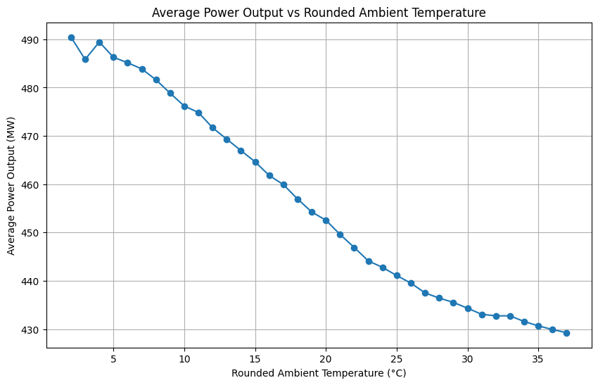

# ⚡ Power Plant Energy Output Prediction (Regression Project)

This project predicts the **net hourly electrical energy output (PE)** of a Combined Cycle Power Plant based on environmental factors using a regression model.

As part of my learning journey, I build this project using **Google BigQuery** for data storage and analysis, and **Vertex AI Workbench** for model development and training.  

## 📒 Table of Contents

- [Usage](#-usage)
  - [Dataset](#-dataset)
  - [Installation & Requirements](#️-installation--requirements)
  - [Technologies Used](#️-technologies-used)
- [Project Overview](#-project-overview)
- [Key Dataset Insights](#-key-dataset-insights)
- [Visual Analysis](#-visual-analysis)
- [Model Training](#-model-training)
- [Model Performance](#-model-performance)

## ⚡ Usage
### 📄 Dataset
- Combined Cycle Power Plant dataset from the [UCI Machine Learning Repository](https://archive.ics.uci.edu/ml/datasets/Combined+Cycle+Power+Plant).
### ⚙️ Installation & Requirements

1. Clone this repository:
```bash
git clone https://github.com/hendrialvt/power-plant-project.git
```
2. Install dependencies
```
pip install -r requirements.txt
```
### 🛠️ Technologies Used
- Python  
- Pandas, NumPy  
- Scikit-learn  
- Google Cloud BigQuery  
- Google Cloud Storage  
- Vertex AI JupyterLab

## 📖 Project Overview

This project uses the **Combined Cycle Power Plant dataset** from the UCI Machine Learning Repository. The dataset contains operational data collected from a power plant over several years (typically from **2006 to 2010**) in Turkey.

It includes **hourly measurements** of various environmental and operational factors, resulting in over **40,000 data points** in total across all years.

Features:
- **AT (Ambient Temperature):** Outside temperature in °C.
- **V (Exhaust Vacuum):** Pressure inside the turbine’s vacuum system.
- **AP (Ambient Pressure):** Atmospheric pressure in millibars.
- **RH (Relative Humidity):** Air moisture percentage.
- **PE (Power Output):** Net hourly electrical energy output in megawatts (MW).

## 📊 Key Dataset Insights

| Metric                           | Value     |
| -------------------------------- | --------- |
| **Min Ambient Temperature (AT)** | 1.81 °C   |
| **Max Ambient Temperature (AT)** | 37.11 °C  |
| **Avg Ambient Temperature (AT)** | 19.65 °C  |
| **Min Power Output (PE)**        | 420.26 MW |
| **Max Power Output (PE)**        | 495.76 MW |
| **Avg Power Output (PE)**        | 454.37 MW |

- **Ambient Temperature (AT):** Ranges from **1.81°C** to **37.11°C** (average: **19.65°C**).
- **Power Output (PE):** Ranges from **420.26 MW** to **495.76 MW** (average: **454.37 MW**).
- Higher ambient temperatures reduce cooling efficiency and overall thermal efficiency in the plant, leading to lower energy output.
- This suggests ambient temperature is an important feature for predicting the plant’s energy output.

## 📈 Visual Analysis



This plot shows the **average power output** at each rounded ambient temperature:

- Power output decreases as ambient temperature increases.
- This negative correlation is expected due to reduced thermal efficiency at higher temperatures.
- The smooth downward trend highlights the importance of including temperature in the machine learning model.

## 📈 Model Training

- **Model Used:** Random Forest Regressor  
- **Training Workflow:**
  - Data pulled from BigQuery
  - Data split into training and testing sets
  - Model trained on training set using Random Forest Regressor

## 📊 Model Performance

Below are the model’s performance metrics on the test set:

| Metric                     | Value |
|----------------------------|-------|
| Mean Absolute Error (MAE)  | 0.1395 MW |
| Root Mean Squared Error (RMSE) | 0.3056 MW |
| R² Score                   | 0.9997 |
